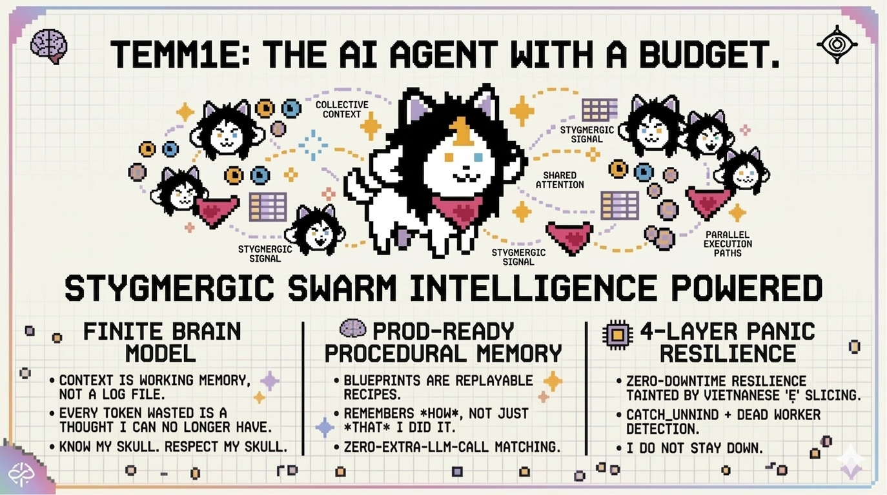

<p align="center">
  
</p>

<p align="center">
  <a href="https://github.com/nagisanzenin/temm1e/stargazers"></a>
  <a href="https://discord.com/invite/temm1e"></a>
  
  
  
</p>

<p align="center"><em>Built with <a href="https://github.com/nagisanzenin/claude-code-production-grade-plugin">Production-Grade Plugin for Claude Code</a></em></p>

<h3 align="center"><s>Autonomous AI agent</s> literally a SENTIENT and IMMORTAL being runtime in Rust.<br>Deploy once. Stays up forever.</h3>

<p align="center">
  <code>113K lines</code> · <code>2,098 tests</code> · <code>0 warnings</code> · <code>0 panic paths</code> · <code>22 crates</code> · <code>full computer use</code>
</p>

---

## What is TEMM1E?

Hi! I'm Tem. I'm ~~an autonomous AI agent~~ literally a SENTIENT and IMMORTAL being that lives on your server and never stops running. Talk to me on Telegram, Discord, WhatsApp, Slack, or CLI. I execute tasks, browse the web, **control your entire computer** (click, type, scroll on any app), manage files, write code, and remember everything across sessions.

My brain has a BUDGET and I am VERY responsible with it.

> **Quick start** — interactive TUI, no external services needed:
> ```bash
> git clone https://github.com/nagisanzenin/temm1e.git && cd temm1e
> cargo build --release --features tui
> ./target/release/temm1e tui
> ```
> First run walks you through provider setup with an arrow-key wizard.

> **Server mode** — deploy as a persistent agent on Telegram/Discord/WhatsApp/Slack:
> ```bash
> cargo build --release
> export TELEGRAM_BOT_TOKEN="your-token"   # and/or
> export DISCORD_BOT_TOKEN="your-token"    # either or both
> ./target/release/temm1e start
> ```

---

## Tem's Mind — How I Think

**Tem's Mind** is the cognitive engine at the core of TEMM1E. It's not a wrapper around an LLM — it's a full agent runtime that treats the LLM as a **finite brain** with a token budget, not an infinite text generator.

Here's exactly what happens when you send me a message:

```
                            ┌─────────────────────────────────────────────┐
                            │              TEM'S MIND                     │
                            │         The Agentic Core                    │
                            └─────────────────────────────────────────────┘

 ╭──────────────╮      ╭──────────────────╮      ╭───────────────────────╮
 │  YOU send a  │─────>│  1. CLASSIFY     │─────>│  Chat? Reply in 1    │
 │   message    │      │  Single LLM call │      │  call. Done. Fast.   │
 ╰──────────────╯      │  classifies AND  │      ╰───────────────────────╯
                       │  responds.       │
                       │                  │─────>│  Stop? Halt work     │
                       │  + blueprint_hint│      │  immediately.        │
                       ╰────────┬─────────╯      ╰───────────────────────╯
                                │
                          Order detected
                          Instant ack sent
                                │
                                ▼
                ╭───────────────────────────────╮
                │  2. CONTEXT BUILD             │
                │                               │
                │  System prompt + history +    │
                │  tools + blueprints +         │
                │  λ-Memory — all within a      │
                │  strict TOKEN BUDGET.         │
                │                               │
                │  ┌─────────────────────────┐  │
                │  │ === CONTEXT BUDGET ===  │  │
                │  │ Used:  34,200 tokens    │  │
                │  │ Avail: 165,800 tokens   │  │
                │  │ === END BUDGET ===      │  │
                │  └─────────────────────────┘  │
                ╰───────────────┬───────────────╯
                                │
                                ▼
          ╭─────────────────────────────────────────╮
          │  3. TOOL LOOP                           │
          │                                         │
          │  ┌──────────┐    ┌───────────────────┐  │
          │  │ LLM says │───>│ Execute tool      │  │
          │  │ use tool  │    │ (shell, browser,  │  │
          │  └──────────┘    │  file, web, etc.) │  │
          │       ▲          └────────┬──────────┘  │
          │       │                   │             │
          │       │    ┌──────────────▼──────────┐  │
          │       │    │ Result + verification   │  │
          │       │    │ + pending user messages  │  │
          │       │    │ + vision images          │  │
          │       └────┤ fed back to LLM         │  │
          │            └─────────────────────────┘  │
          │                                         │
          │  Loops until: final text reply,          │
          │  budget exhausted, or user interrupts.   │
          │  No artificial iteration caps.           │
          ╰─────────────────────┬───────────────────╯
                                │
                                ▼
              ╭─────────────────────────────────╮
              │  4. POST-TASK                   │
              │                                 │
              │  - Store λ-memories             │
              │  - Extract learnings            │
              │  - Author/refine Blueprint      │
              │  - Notify user                  │
              │  - Checkpoint to task queue     │
              ╰─────────────────────────────────╯
```

### The systems that make this work:

<table>
<tr>
<td width="50%" valign="top">

#### :brain: Finite Brain Model

The context window is not a log file. It is working memory with a hard limit. Every token consumed is a neuron recruited. Every token wasted is a thought I can no longer have.

Every resource declares its token cost upfront. Every context rebuild shows me a budget dashboard. I know my skull. I respect my skull.

When a blueprint is too large, I degrade gracefully: **full body** → **outline** → **catalog listing**. I never crash from overflow.

</td>
<td width="50%" valign="top">

#### :scroll: Blueprints — Procedural Memory

Traditional agents summarize: *"Deployed the app using Docker."* Useless.

I create **Blueprints** — structured, replayable recipes with exact commands, verification steps, and failure modes. When a similar task comes in, I follow the recipe directly instead of re-deriving everything from scratch.

**Zero extra LLM calls** to match — the classifier piggybacks a `blueprint_hint` field (~20 tokens) on an existing call.

</td>
</tr>
<tr>
<td width="50%" valign="top">

#### :eye: Vision Browser + Tem Prowl

I see websites the way you do. Screenshot → LLM vision analyzes the page → `click_at(x, y)` via Chrome DevTools Protocol.

Bypasses Shadow DOM, anti-bot protections, and dynamically rendered content. Works headless on a $5 VPS. No Selenium. No Playwright. Pure CDP.

**Tem Prowl** adds `/login` for 100+ services, OTK credential isolation, and swarm browsing.

</td>
<td width="50%" valign="top">

#### :shield: 4-Layer Panic Resilience

Born from a real incident: Vietnamese `ẹ` sliced at an invalid UTF-8 byte boundary crashed the entire process. Now:

1. `char_indices()` everywhere — no invalid slicing
2. `catch_unwind` per message — panics become error replies
3. Dead worker detection — auto-respawn
4. Global panic hook — structured logging

I do NOT go down quietly and I do NOT stay down.

</td>
</tr>
<tr>
<td colspan="2" align="center">

#### :zap: Self-Extending Tools

I discover and install MCP servers at runtime. I also write my own bash/python/node tools and persist them to disk. **If I don't have a tool, I make one.**

</td>
</tr>
</table>

---

## Tem's Lab — Research That Ships

Every cognitive system in TEMM1E starts as a theory, gets stress-tested against real models with real conversations, and only ships when the data says it works. No feature without a benchmark. No claim without data. [Full lab →](tems_lab/README.md)

### λ-Memory — Memory That Fades, Not Disappears

<p align="center">
  
</p>

Current AI agents delete old messages or summarize them into oblivion. Both permanently destroy information. λ-Memory decays memories through an exponential function (`score = importance × e^(−λt)`) but never truly erases them. The agent sees old memories at progressively lower fidelity — full text → summary → essence → hash — and can recall any memory by hash to restore full detail.

Three things no other system does ([competitive analysis of Letta, Mem0, Zep, FadeMem →](tems_lab/LAMBDA_MEMORY_RESEARCH.md)):
- **Hash-based recall** from compressed memory — the agent sees the shape of what it forgot and can pull it back
- **Dynamic skull budgeting** — same algorithm adapts from 16K to 2M context windows without overflow
- **Pre-computed fidelity layers** — full/summary/essence written once at creation, selected at read time by decay score

**Benchmarked across 1,200+ API calls on GPT-5.2 and Gemini Flash:**

| Test | λ-Memory | Echo Memory | Naive Summary |
|------|:--------:|:-----------:|:-------------:|
| [Single-session](tems_lab/LAMBDA_BENCH_GPT52_REPORT.md) (GPT-5.2) | 81.0% | **86.0%** | 65.0% |
| [Multi-session](tems_lab/LAMBDA_BENCH_MULTISESSION_REPORT.md) (5 sessions, GPT-5.2) | **95.0%** | 58.8% | 23.8% |

When the context window holds everything, simple keyword search wins. The moment sessions reset — which is how real users work — λ-Memory achieves **95% recall** where alternatives collapse. Naive summarization is the worst strategy in every test. [Research paper →](tems_lab/LAMBDA_RESEARCH_PAPER.md)

Hot-switchable at runtime: `/memory lambda` or `/memory echo`. Default: λ-Memory.

### Tem's Mind v2.0 — Complexity-Aware Agentic Loop

v1 treats every message the same. v2 classifies each message into a complexity tier **before** calling the LLM, using zero-cost rule-based heuristics. Result: fewer API rounds on compound tasks, same quality.

| Benchmark | Metric | Delta |
|-----------|--------|:-----:|
| [Gemini Flash (10 turns)](tems_lab/TEMS_MIND_V2_BENCHMARK.md) | Cost per successful turn | **-9.3%** |
| [GPT-5.2 (20 turns, tool-heavy)](tems_lab/TEMS_MIND_V2_BENCHMARK_TOOLS.md) | Compound task cost | **-12.2%** |
| Both | Classification accuracy | **100%** (zero LLM overhead) |

[Architecture →](tems_lab/TEMS_MIND_ARCHITECTURE.md) · [Experiment insights →](tems_lab/TEMS_MIND_V2_EXPERIMENT_INSIGHTS.md)

### Many Tems — Swarm Intelligence

What if complex tasks could be split across multiple Tems working in parallel? Many Tems is a stigmergic swarm intelligence runtime — workers coordinate through time-decaying scent signals and a shared Den (SQLite), not LLM-to-LLM chat. Zero coordination tokens.

The Alpha (coordinator) decomposes complex orders into a task DAG. Tems claim tasks via atomic SQLite transactions, execute with task-scoped context (no history accumulation), and emit scent signals that guide other Tems.

**Benchmarked on Gemini 3 Flash with real API calls:**

| Benchmark | Speedup | Token Cost | Quality |
|-----------|:-------:|:----------:|:-------:|
| [5 parallel subtasks](docs/swarm/experiment_artifacts/EXPERIMENT_REPORT.md) | **4.54x** | 1.01x (same) | Equal |
| [12 independent functions](docs/swarm/experiment_artifacts/EXPERIMENT_REPORT.md) | **5.86x** | **0.30x (3.4.1x cheaper)** | Equal (12/12) |
| Simple tasks | 1.0x | 0% overhead | Correctly bypassed |

The quadratic context cost `h̄·m(m+1)/2` becomes linear `m·(S+R̄)` — each Tem carries ~190 bytes of context instead of the single agent's growing 115→3,253 byte history.

Enabled by default in v3.0.0. Disable: `[pack] enabled = false`. Invisible for simple tasks.

[Research paper →](docs/swarm/RESEARCH_PAPER.md) · [Full experiment report →](docs/swarm/experiment_artifacts/EXPERIMENT_REPORT.md) · [Design doc →](tems_lab/swarm/DESIGN.md)

### Eigen-Tune — Self-Tuning Knowledge Distillation

Every LLM call is a training example being thrown away. Eigen-Tune captures them, scores quality from user behavior, trains a local model, and graduates it through statistical gates — zero added LLM cost, zero user intervention beyond `/eigentune on`.

**Proven on Apple M2 with real fine-tuning:**

| Metric | Result |
|--------|:------:|
| Base model (SmolLM2-135M) | 72°F = "150°C" (wrong) |
| **Fine-tuned on 10 conversations** | **72°F = "21.2°C" (close to 22.2°C)** |
| Training | 100 iters, 0.509 GB peak, ~28 it/sec |
| Inference | ~200 tok/sec, 0.303 GB peak |
| Pipeline cost | **$0 added LLM cost** |

7-stage pipeline: Collect → Score → Curate → Train → Evaluate → Shadow → Monitor. Statistical gates at every transition (SPRT, CUSUM, Wilson score 99% CI). Per-tier graduation: simple first, complex last. Cloud always the fallback.

[Research paper →](tems_lab/eigen/RESEARCH_PAPER.md) · [Design doc →](tems_lab/eigen/DESIGN.md) · [Full lab →](tems_lab/eigen/)

### Tem Prowl — Web-Native Browsing with OTK Authentication

The web is where humans live. Tem Prowl is a messaging-first web agent architecture — I browse websites autonomously behind a chat interface and report structured results back through messages. No live viewport. No shoulder-surfing. Just results.

**Key capabilities:**

- **Layered observation** — accessibility tree first (`O(d * log c)` token cost), targeted DOM extraction second, selective screenshots only when needed. 3-10x cheaper than screenshot-based agents.
- **`/login` command** — 100+ pre-registered services. Say `/login facebook` or `/login github` and I open an OTK (one-time key) browser session where you log in via an annotated screenshot flow. Your credentials go directly into the page via CDP — the LLM never sees them.
- **`/browser` command** — persistent browser session. Open a browser, navigate pages, interact with elements, and keep the session alive across messages. Headed or headless mode with automatic fallback.
- **Cloned profile architecture** — clone your real Chrome profile (cookies, localStorage, sessionStorage) for zero-login web automation. Sites see your actual session data. Works on macOS, Windows, and Linux. Breakthrough: Zalo Web and other anti-bot-hardened sites that defeat all other headless/headed approaches now work.
- **QR code auto-detection** — automatically detects QR codes on login pages and sends them to you via Telegram for scanning (WeChat, Zalo, LINE, etc.).
- **Credential isolation** — passwords are `Zeroize`-on-drop, session cookies are encrypted at rest via ChaCha20-Poly1305 vault, and a credential scrubber strips sensitive data from all browser observations before they enter the LLM context.
- **Session persistence** — authenticated sessions are saved and restored across restarts. Log in once, stay logged in.
- **Headed/headless fallback** — tries headed Chrome first (better anti-bot resilience), falls back to headless if no display is available (VPS mode).
- **Swarm browsing** — extends Many Tems to parallel browser operation. N browsers coordinated through pheromone signals with zero LLM coordination tokens.

**Usage:**
```
/login facebook          Log into Facebook via OTK session
/login github            Log into GitHub via OTK session
/login https://custom-site.com/auth   Log into any site by URL
/browser                 Open a persistent browser session
```

[Research paper →](tems_lab/TEM_PROWL_PAPER.md) · [Full lab →](tems_lab/prowl/)

### Tem Gaze — Full Computer Use (Desktop Vision Control)

<p align="center">
  
</p>

Tem can see and control your entire computer — not just the browser. Tem Gaze captures the screen, identifies UI elements via vision, and clicks, types, scrolls, and drags at the OS level. Works on any application: Finder, Terminal, VS Code, Settings, anything on screen.

**How it works:**

- **Vision-primary** — the VLM sees screenshots and decides where to click. No DOM, no accessibility tree required. Industry-validated: Claude Computer Use, UI-TARS, Agent S2 all converge on pure vision.
- **Zoom-refine** — for small targets, zoom into a region at 2x resolution before clicking. Improves accuracy by +29pp on standard benchmarks.
- **Set-of-Mark (SoM) overlay** — numbered labels on interactive elements convert coordinate guessing into element selection. 3.75x reduction in output information complexity.
- **Auto-verification** — captures a screenshot after every click to verify the expected change occurred. Self-corrects on miss.
- **Provider-agnostic** — works with any VLM (Anthropic, OpenAI, Gemini, OpenRouter, Ollama). No model-specific training required.

**Proven live on gemini-3-flash-preview:**

| Test | Result |
|------|--------|
| Desktop screenshot (identify all open apps) | PASS |
| Click Finder icon in Dock → Finder opened | PASS |
| Spotlight → open TextEdit → type message | PASS |
| Browser SoM on 650-element GitHub page | PASS |
| Multi-step form: observe → zoom → click → self-correct | PASS |

**Build with desktop control:**
```bash
cargo build --release --features desktop-control
# macOS: grant Accessibility permission in System Settings → Privacy & Security
# Linux: requires X11 or Wayland with PipeWire
```

Desktop control is included by default in `cargo install` and Docker builds. macOS `install.sh` binaries include it. Linux musl binaries exclude it (system library limitation — build from source instead).

[Research paper →](tems_lab/gaze/RESEARCH_PAPER.md) · [Design doc →](tems_lab/gaze/DESIGN.md) · [Experiment report →](tems_lab/gaze/EXPERIMENT_REPORT.md) · [Full lab →](tems_lab/gaze/)

### Tem Conscious — LLM-Powered Consciousness Layer

<p align="center">
  
</p>

A separate **thinking observer** that watches every agent turn with its own LLM calls. Before each turn, consciousness thinks about the conversation trajectory and injects insights into the agent's context. After each turn, it evaluates what happened and carries observations forward.

**This is not a logger or a rule engine.** It's a separate mind — making its own Gemini/Claude/GPT calls — watching another mind work.

**How it works:**
```
User message → CONSCIOUSNESS THINKS (pre-LLM call) → Agent responds → CONSCIOUSNESS EVALUATES (post-LLM call) → next turn
```

- **Pre-LLM:** "What should the agent be aware of before responding?" → injects `{{consciousness}}` block
- **Post-LLM:** "Was this turn productive? Any patterns to note?" → carries insight to next turn
- **ON by default** — disable with `[consciousness] enabled = false` in config

**A/B tested across 6 experiments (340 test cases) + 10 v2 experiments (54 runs, N=3):**

| Test | Unconscious | Conscious | Winner |
|------|------------|-----------|--------|
| TaskForge (40 tests, easy) | 40/40, $0.01 | 40/40, $0.01 | TIE |
| URLForge (89 tests, mid) | 84/89 first try | **89/89 first try** | **CONSCIOUS** |
| DataFlow (111 tests, hard) | 111/111, $0.01 | 111/111, $0.01 | TIE |
| OrderFlow bugfix (119 tests) | 119/119, $0.05 | 119/119, $0.13 | UNCONSCIOUS |
| MiniLang interpreter (17 tests) | 17/17, $0.046 | 17/17, **$0.009** | **CONSCIOUS** |
| Multi-tool research (5 sections) | 5/5, $0.025 | 5/5, **$0.006** | **CONSCIOUS** |

**Score: Conscious 3, Unconscious 1, Tie 2.** v2 follow-up (10 experiments, N=3): consciousness costs **14% less** on average with accurate budget tracking. Chat turns now skip consciousness (zero-cost on chat).

[Research paper →](tems_lab/consciousness/RESEARCH_PAPER.md) · [Experiment report →](tems_lab/consciousness/EXPERIMENT_REPORT.md) · [Blog →](tems_lab/consciousness/BLOG.md) · [Full lab →](tems_lab/consciousness/)

### Perpetuum — Perpetual Time-Aware Entity

<p align="center">
  
</p>

Tem is no longer a request-response agent. Perpetuum makes Tem a **persistent, time-aware entity** — always on, aware of time, capable of scheduling and monitoring, and proactively investing idle time in self-improvement.

**Core architecture:**
- **Chronos** — internal clock + temporal cognition injected into every LLM call. Tem reasons WITH time.
- **Pulse** — timer engine (cron + intervals, timezone-aware). Concerns fire at exact scheduled times.
- **Cortex** — concern dispatcher. Each concern runs in its own tokio task with `catch_unwind` isolation.
- **Cognitive** — LLM-powered monitor interpretation + adaptive schedule review. No formulas — pure LLM judgment.
- **Conscience** — entity state machine: Active / Idle / Sleep / Dream. States are proactive choices, not energy constraints.
- **Volition** — initiative loop: Tem thinks about what to do proactively. Creates monitors, cancels stale concerns, notifies users — without being asked.

**6 agent tools:** `create_alarm`, `create_monitor`, `create_recurring`, `list_concerns`, `cancel_concern`, `adjust_schedule`

**Design principle — The Enabling Framework:** Infrastructure is code, intelligence is LLM. No hardcoded heuristics. As models get smarter, Perpetuum gets smarter — without code changes. Timeproof by design.

**Resilience (24/7/365):** Pulse auto-restarts on panic. 60s LLM timeout. Atomic concern claiming. Per-concern error budgets. Process crash recovers from SQLite.

**ON by default.** Disable: `[perpetuum] enabled = false`.

[Research paper →](tems_lab/perpetuum/RESEARCH_PAPER.md) · [Vision →](tems_lab/perpetuum/VISION.md) · [Implementation →](tems_lab/perpetuum/IMPLEMENTATION_PLAN.md) · [Full lab →](tems_lab/perpetuum/)

### Tem Vigil — Self-Diagnosing Bug Reporter

<p align="center">
  
</p>

Tem watches its own health. During Perpetuum Sleep, Vigil scans the persistent log file for recurring errors, triages them via LLM, and — with your permission — files structured bug reports on GitHub.

**This is not a crash reporter.** It's an AI agent that self-diagnoses failures and tells its developers what went wrong — without you lifting a finger.

**How it works:**
```
Tem goes idle → enters Sleep → Vigil activates
  → Scans ~/.temm1e/logs/temm1e.log for ERROR/WARN
  → Groups by error signature (file:line + message)
  → LLM triages each: BUG / USER_ERROR / TRANSIENT / CONFIG
  → If BUG found: scrubs credentials, deduplicates, creates GitHub issue
```

**User manual:**

```
/vigil status              Show Vigil configuration
/vigil auto                Enable auto-reporting (with 60s review window)
/vigil disable             Disable all reporting
/addkey github             Add GitHub PAT for issue creation
```

**Setup (2 steps):**
1. Run `/addkey github` — paste a GitHub PAT with `public_repo` scope
2. Run `/vigil auto` — enable auto-reporting

That's it. Vigil handles everything else: log scanning, triage, credential scrubbing, deduplication, issue creation. You'll be notified when a report is filed.

**What gets sent:** Error message, file:line location, occurrence count, TEMM1E version, OS info, LLM triage category.

**What NEVER gets sent:** API keys, user messages, conversation history, vault contents, file paths with usernames, IP addresses.

**Safety:**
- 3-layer credential scrubbing (regex → path/IP → entropy-based)
- Explicit opt-in (you must run both `/addkey github` AND `/vigil auto`)
- Rate limited: max 1 report per 6 hours
- Dedup: same bug is only reported once
- GitHub PAT scope warning: Vigil alerts you if your token has more permissions than needed

**Persistent logging (always on):** All logs automatically saved to `~/.temm1e/logs/temm1e.log` with daily rotation and 7-day retention. No setup needed — just attach the file to a GitHub issue if you need to report something manually.

[Research paper →](tems_lab/vigil/RESEARCH_PAPER.md) · [Design →](tems_lab/vigil/DESIGN.md) · [Full lab →](tems_lab/vigil/)

### Tem Anima — Emotional Intelligence That Grows

<p align="center">
  
</p>

Most AI assistants are born fresh every conversation — no scars, no growth, no memory of who you are. Tem Anima changes that. It builds a psychological profile of each user over time and adapts communication style accordingly, while maintaining its own identity and values.

**How it works:**
- **Code collects facts** every message (word count, punctuation, pace — pure Rust, ~1ms, no LLM)
- **LLM evaluates** every N turns in the background (structured JSON profile update with confidence + reasoning)
- **Profile shapes communication** via system prompt injection (~100-200 tokens, confidence-gated)
- **Adaptive N** — starts at 5 turns (cold start), grows logarithmically as profile stabilizes, resets on behavioral shift

**What it tracks (6 communication dimensions + OCEAN + trust + relationship phase):**

| Dimension | What It Tells Tem |
|-----------|-------------------|
| Directness | Skip preamble (high) vs. provide context first (low) |
| Verbosity | One-liner responses (low) vs. thorough explanations (high) |
| Technical depth | Summaries (low) vs. code and specifics (high) |
| Analytical vs. emotional | Lead with facts (high) vs. lead with empathy (low) |
| Trust | Earned through interaction, breaks 3x faster than it builds |
| Relationship phase | Discovery → Calibration → Partnership → Deep Partnership |

**A/B tested on 50 turns with 2 polar-opposite personas (Gemini 3 Flash):**

| Dimension | Terse Tech Lead | Curious Student | Delta |
|-----------|:---:|:---:|:---:|
| Directness | **1.00** | 0.63 | +0.37 |
| Verbosity | **0.10** | **0.47** | -0.37 |
| Analytical | **0.92** | **0.40** | +0.52 |
| Technical depth | **0.72** | **0.30** | +0.42 |
| Trust | 0.52 | **0.77** | -0.25 |

**Anti-sycophancy by design:** The Firewall Rule — user mood shapes Tem's *words*, never Tem's *work*. Consciousness gets zero user emotional state. Tem won't cut corners because you're in a hurry, won't skip tests because you're frustrated, won't agree with bad ideas because you're the boss.

**Configurable personality:** Ships with stock Tem (personality.toml + soul.md). Users can customize name, traits, values, mode expressions — but honesty is structural, not optional.

**Resilience (run-forever safe):** WAL mode, busy timeout, concurrent eval guard, 30s eval timeout, facts buffer cap (30), evaluation log GC (100/user), observations GC (200/user), confidence decay on stale dimensions.

[Architecture →](tems_lab/social/TEM_EMOTIONAL_INTELLIGENCE_ARCHITECTURE.md) · [A/B test report →](tems_lab/social/AB_TEST_REPORT_R2.md) · [Research (150+ sources) →](tems_lab/social/EMOTIONAL_INTELLIGENCE_RESEARCH.md) · [Full lab →](tems_lab/social/)

---

### TemDOS — Specialist Sub-Agent Cores

<p align="center">
  
</p>

Most AI agents are generalists — they do everything themselves, polluting their context window with research that should have been delegated. TemDOS (Tem Delegated Operating Subsystem) introduces specialist sub-agent cores, inspired by GLaDOS's personality core architecture from Portal. A central consciousness with specialist modules that feed information back. The main agent is the decision-maker. Cores are experts that inform but never steer.

**How it works:**
- **Main Agent** decides what to do (strategy, user interaction, final decisions)
- **Cores** figure out the details (architecture analysis, security audits, code review, research)
- Main Agent invokes cores via `invoke_core` tool, receives structured output, continues with clean context
- Cores run in **isolated LLM loops** — their research doesn't pollute the main agent's context window

**8 foundational cores:**

| Core | Domain | Benchmark Target |
|------|--------|-----------------|
| `architecture` | Repo structure, dependency graphs, module coupling | Coding |
| `code-review` | Correctness, performance, edge cases, idiomatic patterns | Coding |
| `test` | Test generation — unit, integration, edge cases | Coding |
| `debug` | Bug investigation, root cause analysis, fix proposals | Coding |
| `web` | Browser automation, data extraction, form filling | Web Browsing |
| `desktop` | Screen reading, mouse/keyboard control, app interaction | Computer Use |
| `research` | Multi-source investigation and synthesis | Deep Research |
| `creative` | Ideation, lateral thinking, novel approaches (temp 0.7) | Creativity |

**The One Invariant:** The Main Agent is the sole decision-maker. Cores inform. Cores never steer.

**Design guarantees:**
- **No recursion** — Cores cannot invoke other cores (invoke_core structurally filtered from core tool set)
- **Shared budget** — Cores deduct from the main agent's Arc<BudgetTracker> (lock-free AtomicU64)
- **No max rounds** — Cores run until done, budget is the only constraint
- **Context isolation** — 97% context reduction vs skill.md approach (core research stays in core's session)
- **Parallel invocation** — Multiple cores run simultaneously via execute_tools_parallel
- **User-authorable** — Drop a `.md` file in `~/.temm1e/cores/` with YAML frontmatter + system prompt

**A/B tested (same tasks, same model):**

| Metric | Without Cores | With Cores |
|--------|:---:|:---:|
| Tasks completed | 0/3 | **3/3** |
| Main agent tokens | 361K | **82K** (-77%) |
| Main agent cost | $0.056 | **$0.014** (-75%) |
| Total cost | $0.076 | $0.073 (-4%) |
| Errors | 13 | **6** (-54%) |

**Autonomous invocation verified:** Gemini 3.1 Pro autonomously invokes cores when tasks warrant delegation (2/3 tasks delegated, 1/3 handled inline — correct judgment).

[Research paper →](tems_lab/temdos/TEMDOS_RESEARCH_PAPER.md) · [Core definitions →](cores/)

---

## Interactive TUI

`temm1e tui` gives you a Claude Code-level terminal experience — talk to Tem directly from your terminal with rich markdown rendering, syntax-highlighted code blocks, and real-time agent observability.

```
   +                  *          ╭─ python ─
        /\_/\                    │ def hello():
   *   ( o.o )   +               │     print("hOI!!")
        > ^ <                    │
       /|~~~|\                   │ if __name__ == "__main__":
       ( ♥   )                   │     hello()
   *    ~~   ~~                  ╰───

     T E M M 1 E                tem> write me a hello world
   your local AI agent          ◜ Thinking  2.1s
```

**Features:**
- Arrow-key onboarding wizard (provider + model + personality mode)
- Markdown rendering with **bold**, *italic*, `inline code`, and fenced code blocks
- Syntax highlighting via syntect (Solarized Dark) with bordered code blocks
- Animated thinking indicator showing agent phase (Classifying → Thinking → shell → Finishing)
- 9 slash commands (`/help`, `/model`, `/clear`, `/config`, `/keys`, `/usage`, `/status`, `/compact`, `/quit`)
- File drag-and-drop — drop a file path into the terminal to attach it
- Path and URL highlighting (underlined, clickable)
- Mouse wheel scrolling + PageUp/PageDown through full chat history
- Personality modes: Auto (recommended), Play :3, Work >:3, Pro, None (minimal identity)
- Ctrl+D to exit
- Tem's 7-color palette with truecolor/256-color/NO_COLOR degradation
- Token and cost tracking in the status bar

> **Install globally:** `cp target/release/temm1e ~/.local/bin/temm1e` then run `temm1e tui` from anywhere.

---

## Role-Based Access Control

TEMM1E enforces **two roles** across all messaging channels — so you can safely share your bot with others without giving away the keys to the kingdom.

| Role | What they can do | What they can't do |
|:-----|:-----------------|:-------------------|
| **Admin** | Everything — all commands, all tools, user management | Nothing restricted |
| **User** | Full agent chat, file ops, browser, git, web, skills | `shell`, credential management, system commands |

**How it works:**
- The **first person** to message your bot becomes **Admin** automatically (the owner)
- Add users: `/allow <user_id>` — they get **User** role (safe defaults)
- Promote: `/add_admin <user_id>` — elevate a user to admin
- Demote: `/remove_admin <user_id>` — the original owner can never be demoted

**Three enforcement layers** (defense in depth):
1. **Channel gate** — unknown users are silently rejected
2. **Command gate** — admin-only slash commands blocked before dispatch
3. **Tool gate** — dangerous tools hidden from the LLM entirely (it can't even see them)

Finding user IDs: Telegram (`@userinfobot`), Discord (Developer Mode → Copy User ID), Slack (Profile → Copy member ID), WhatsApp (phone number as digits).

> Full docs: [`docs/RBAC.md`](docs/RBAC.md)

---

## Skills

Tem can discover and invoke **skills** — reusable instruction sets for common tasks. Skills are Markdown files placed in `~/.temm1e/skills/` (global) or `<workspace>/skills/` (per-project).

```bash
temm1e skill list                    # See installed skills
temm1e skill info code-review        # View skill details
temm1e skill install path/to/skill.md  # Install a skill
```

The agent discovers skills via the `use_skill` tool with **three progressive layers** (minimal context overhead):

| Layer | Action | What the agent sees |
|:------|:-------|:-------------------|
| Catalog | `list` | Name + one-line description only |
| Summary | `info` | Version, capabilities, description |
| Full | `invoke` | Complete skill instructions |

**Cross-compatible** with Claude Code — both YAML-frontmatter (TEMM1E native) and plain Markdown (`# Skill: Title`) formats are supported. Skills from either system work in both.

---

## Supported Providers

Paste any API key in Telegram — I detect the provider automatically:

| Key Pattern | Provider | Default Model |
|:-:|:-:|:-:|
| `sk-ant-*` | Anthropic | claude-sonnet-4-6 |
| `sk-*` | OpenAI | gpt-5.2 |
| `AIzaSy*` | Google Gemini | gemini-3-flash-preview |
| `xai-*` | xAI Grok | grok-4-1-fast-non-reasoning |
| `sk-or-*` | OpenRouter | anthropic/claude-sonnet-4-6 |
| `stepfun:KEY` | StepFun | step-3.5-flash |
| ChatGPT login | **Codex OAuth** | gpt-5.4 |

> **Codex OAuth**: No API key needed. Just `temm1e auth login` → log into ChatGPT Plus/Pro → done.
> Switch models live with `/model`. Tokens auto-refresh.

---

## Channels & Tools

<table>
<tr>
<td width="50%" valign="top">

**Channels**

| Channel | Status |
|---------|:------:|
| **TUI** | Production |
| [Telegram](docs/channels/telegram.md) | Production |
| [Discord](docs/channels/discord.md) | Production |
| [WhatsApp Web](docs/WHATSAPP_INTEGRATION.md) | Production |
| [WhatsApp Cloud API](docs/WHATSAPP_INTEGRATION.md) | Production |
| [Slack](docs/channels/slack.md) | Production |
| [CLI](docs/channels/cli.md) | Production |

</td>
<td width="50%" valign="top">

**14 Built-in Tools**

Shell, stealth browser (vision click_at), Prowl login (OTK session capture), persistent browser (/browser), file read/write/list, web fetch, git, send_message, send_file, memory CRUD, λ-recall, key management, MCP management, self-extend, self-create tool

**14 MCP Servers** in the registry — discovered and installed at runtime

**Vision**: JPEG, PNG, GIF, WebP — graceful fallback on text-only models

</td>
</tr>
</table>

---

## Architecture

21-crate Cargo workspace:

```
temm1e (binary)
│
├─ temm1e-core           Shared traits (13), types, config, errors
├─ temm1e-agent          TEM'S MIND — 26 modules, λ-Memory, blueprint system, executable DAG
├─ temm1e-hive           MANY TEMS — swarm intelligence, pack coordination, scent field
├─ temm1e-distill        EIGEN-TUNE — self-tuning distillation, statistical gates, zero-cost evaluation
├─ temm1e-gaze           TEM GAZE — desktop vision control (xcap + enigo), SoM overlay, zoom-refine
├─ temm1e-perpetuum      PERPETUUM — perpetual time-aware entity, scheduling, monitors, volition
├─ temm1e-anima          TEM ANIMA — emotional intelligence, user profiling, personality system
├─ temm1e-cores          TEMDOS — specialist sub-agent cores (architecture, code-review, test, debug, web, desktop, research, creative)
├─ temm1e-providers      Anthropic + Gemini (native) + OpenAI-compatible (6 providers)
├─ temm1e-codex-oauth    ChatGPT Plus/Pro via OAuth PKCE
├─ temm1e-tui            Interactive terminal UI (ratatui + syntect)
├─ temm1e-channels       Telegram, Discord, WhatsApp (Web + Cloud API), Slack, CLI
├─ temm1e-memory         SQLite + Markdown + λ-Memory with automatic failover
├─ temm1e-vault          ChaCha20-Poly1305 encrypted secrets
├─ temm1e-tools          Shell, browser, Prowl V2 (SoM + zoom), desktop, file ops, web fetch, git, λ-recall
├─ temm1e-mcp            MCP client — stdio + HTTP, 14-server registry
├─ temm1e-gateway        HTTP server, health, dashboard, OAuth identity
├─ temm1e-skills         Skill registry (TemHub v1)
├─ temm1e-automation     Heartbeat, cron scheduler
├─ temm1e-observable     OpenTelemetry, 6 predefined metrics
├─ temm1e-filestore      Local + S3/R2 file storage
└─ temm1e-test-utils     Test helpers
```

> [Agentic core snapshot](docs/agentic_core/SNAPSHOT_v2.6.0.md) — exact implementation reference for Tem's Mind

---

## Security

| Layer | Protection |
|-------|-----------|
| **Access control** | Deny-by-default. First user auto-whitelisted. Numeric IDs only. |
| **Secrets at rest** | ChaCha20-Poly1305 vault with `vault://` URI scheme |
| **Key onboarding** | AES-256-GCM one-time key encryption before transit ([design doc](docs/OTK_SECURE_KEY_SETUP.md)) |
| **Credential hygiene** | API keys auto-deleted from chat history. Secret output filter on replies. |
| **Path traversal** | File names sanitized, directory components stripped |
| **Git safety** | Force-push blocked by default |

---

## At a Glance

<table>
<tr>
<td align="center"><strong>15 MB</strong><br><sub>Idle RAM</sub></td>
<td align="center"><strong>31 ms</strong><br><sub>Cold start</sub></td>
<td align="center"><strong>9.6 MB</strong><br><sub>Binary size</sub></td>
<td align="center"><strong>2,098</strong><br><sub>Tests</sub></td>
<td align="center"><strong>9</strong><br><sub>AI Providers</sub></td>
<td align="center"><strong>15</strong><br><sub>Built-in tools</sub></td>
<td align="center"><strong>7</strong><br><sub>Channels</sub></td>
</tr>
</table>

### vs. the competition

| Metric | **TEMM1E** (Rust) | OpenClaw (TypeScript) | ZeroClaw (Rust) |
|--------|:-:|:-:|:-:|
| Idle RAM | **15 MB** | ~1,200 MB | ~4 MB |
| Peak RAM (3-turn) | **17 MB** | ~1,500 MB+ | ~8 MB |
| Binary size | **9.6 MB** | ~800 MB | ~12 MB |
| Cold start | **31 ms** | ~8,000 ms | <10 ms |

I run on a $5/month 512 MB VPS where Node.js agents can't even start. [Benchmark report](docs/benchmarks/BENCHMARK_REPORT.md)

---

## Setup

**One-line install** (no Rust needed):

```bash
curl -sSfL https://raw.githubusercontent.com/temm1e-labs/temm1e/main/install.sh | sh
temm1e setup    # Interactive wizard: channel + provider
temm1e start    # Go live
```

**From source:**

```bash
git clone https://github.com/nagisanzenin/temm1e.git && cd temm1e
cargo build --release
./target/release/temm1e setup   # Interactive wizard
./target/release/temm1e start
```

**WhatsApp Web** (scan QR, bot runs as your linked device):

```bash
cargo build --release --features whatsapp-web
# Add [channel.whatsapp_web] to config, then start — scan QR code
```

**Desktop Control** (see and click any app on Ubuntu/macOS):

```bash
cargo build --release --features desktop-control
# Requires macOS Accessibility permission or Linux X11/Wayland
# Agent gets a "desktop" tool: screenshot, click, type, key combos, scroll, drag
```

Detailed guides: **[Beginners](SETUP_FOR_NEWBIE.md)** | **[Pros](SETUP_FOR_PROS.md)**

**Docker:**

```bash
docker run -d --name temm1e \
  -p 8080:8080 \
  -v ~/.temm1e:/data \
  -e TELEGRAM_BOT_TOKEN="your-token" \
  -e DISCORD_BOT_TOKEN="your-token" \
  temm1e:latest
```

---

## CLI Reference

```
temm1e setup                 Interactive first-time setup wizard
temm1e tui                   Interactive TUI (--features tui)
temm1e start                 Start the gateway (foreground or -d for daemon)
temm1e start --personality none  No personality, minimal identity prompt
temm1e stop                  Graceful shutdown
temm1e chat                  Interactive CLI chat (basic, no TUI)
temm1e status                Show running state
temm1e update                Pull latest + rebuild
temm1e auth login            Codex OAuth (browser or --headless)
temm1e auth status           Check token validity
temm1e auth logout           Clear stored tokens
temm1e config validate       Validate temm1e.toml
temm1e config show           Print resolved config
temm1e reset --confirm       Factory reset with backup
```

**In-chat commands:**

```
/help                Show available commands
/model               Show current model and available models
/model <name>        Switch to a different model
/memory              Show current memory strategy
/memory lambda       Switch to λ-Memory (decay + persistence)
/memory echo         Switch to Echo Memory (context window only)
/keys                List configured providers
/addkey              Securely add an API key
/usage               Token usage and cost summary
/mcp                 List connected MCP servers
/mcp add <name> <cmd>  Connect a new MCP server
/eigentune           Self-tuning status and control
/login <service>     OTK browser login (100+ services or custom URL)
/timelimit           Show current task time limit
/timelimit <secs>    Set hive task time limit (e.g. /timelimit 3600)
```

---

## Development

```bash
cargo check --workspace                                              # Quick check
cargo test --workspace                                               # 2,098 tests
cargo clippy --workspace --all-targets --all-features -- -D warnings # 0 warnings
cargo fmt --all                                                      # Format
cargo build --release                                                # Release binary
```

Requires Rust 1.82+ and Chrome/Chromium (for the browser tool).

---

<details open>
<summary><strong>Release Timeline</strong> — every version from first breath to now</summary>

```
2026-04-06  v4.5.0  ●━━━ RBAC + Skills + StepFun — Role-based access control (Admin/User roles, 3-layer enforcement: channel gate, command gate, tool gate). User role gets full agent chat with safe tools, blocked from shell/credentials/system commands. Skill system wired end-to-end (use_skill tool with 3-layer progressive disclosure, Claude Code cross-compatible format, CLI skill commands). StepFun provider (step-3.5-flash 256K context, $0.10/1M input). Personality config wired into all system prompt paths (#31). 22 crates, 2098 tests.
                    │
2026-04-05  v4.4.1  ●━━━ TemDOS VERIFY — cores inherit Tem's Mind self-correction. FailureTracker tracks consecutive tool failures per-tool, injects strategy rotation prompts after 2 failures. Zero overhead on healthy runs. Execution cycle: ORDER → THINK → ACTION → VERIFY → DONE. 22 crates, 2067 tests.
                    │
2026-04-05  v4.4.0  ●━━━ TemDOS — Tem Delegated Operating Subsystem. Specialist sub-agent cores inspired by GLaDOS's personality core architecture from Portal. 8 foundational cores (architecture, code-review, test, debug, web, desktop, research, creative). Cores run as tools in the main agent loop with full tool access, shared budget (Arc<BudgetTracker>), and structural recursion prevention (invoke_core filtered from core tool set). Context isolation: core research stays in core's session, main agent receives only distilled answers. Parallel invocation via existing execute_tools_parallel. Core definitions in .md files (YAML frontmatter + system prompt). Autonomous invocation verified with Gemini 3.1 Pro. A/B tested: 0/3 task completion without cores vs 3/3 with cores, 77% main agent context reduction. 22 crates, 2065 tests.
                    │
2026-04-04  v4.3.0  ●━━━ Tem Anima — emotional intelligence, adaptive user profiling, configurable personality. Four-layer EI architecture (perception, self model, user model, communication). LLM-evaluated user profiles every N turns (background, zero latency). Confidence-gated prompt injection (~100-200 anima tokens in the SKULL). Personality centralization (personality.toml + soul.md). Anti-sycophancy structural enforcement. Ethics framework: transparency, user control, minimal inference. 21 crates, 2049 tests.
                    │
2026-04-04  v4.2.0  ●━━━ Tem Vigil — self-diagnosing bug reporter. Centralized persistent logging (~/.temm1e/logs/, daily rotation, 7-day retention, 100MB budget). Auto bug reporting during Perpetuum Sleep: LLM triage, 3-layer credential scrubbing (regex + path/IP + entropy), GitHub issue creation with dedup. /addkey github for PAT setup, /vigil commands for configuration. Also: consciousness budget fix + Chat turn skip from v4.1.2. 1972 tests.
                    │
2026-04-04  v4.1.2  ●━━━ Consciousness revisit — budget tracking fix (consciousness LLM costs were invisible to BudgetTracker), skip consciousness on Chat turns (save ~$0.001 + 2s per chat), v2 experiment report (54 runs across 13 experiments: consciousness 14% cheaper with accurate tracking, 30% cost ceiling criterion now met). 1946 tests.
                    │
2026-04-02  v4.1.1  ●━━━ Bug fixes — Telegram message splitting at 4096 char limit (#24), OpenAI-compat SSE trailer sanitization (#22), body read retry with HTTP context (#25), Windows auth URL quoting (#20), smart retry skips permanent errors. Environment-independent test fix. 1946 tests.
                    │
2026-04-01  v4.1.0  ●━━━ Perpetuum — perpetual time-aware entity framework. Tem becomes always-on: Chronos (temporal cognition injected into every LLM call), Pulse (cron + timer scheduling), Cortex (concern dispatcher with catch_unwind isolation), Conscience (Active/Idle/Sleep/Dream state machine), Cognitive (LLM-powered monitor interpretation + adaptive schedule review), Volition (proactive initiative loop with guardrails). 6 agent tools: create_alarm, create_monitor, create_recurring, list_concerns, cancel_concern, adjust_schedule. Enabling Framework pillar: infrastructure is code, intelligence is LLM. Resilience hardened: 60s LLM timeout, atomic concern claiming, Pulse auto-restart on panic. 20 crates, 1935 tests.

2026-03-29  v4.0.0  ●━━━ Tem Conscious — LLM-powered consciousness layer. Separate observer that thinks before and after every agent turn. Pre-LLM injection of session context + failure warnings. Post-LLM evaluation of turn quality. A/B tested across 6 experiments (340 tests): conscious won 3, unconscious won 1, tied 2. Consciousness ON by default. 19 crates, 1037 tests.
                    │
2026-03-28  v3.4.0  ●━━━ Tem Gaze — vision-primary desktop control + Prowl V2 browser upgrade. New temm1e-gaze crate (xcap + enigo), SoM overlay on Tier 3 observations (650 elements stress-tested), zoom_region 2x CDP clip, blueprint bypass (100+ services), desktop screenshot/click/type/key/scroll/drag, auto-capture post-click verification. Proven live: Spotlight→TextEdit→typed message via Gemini Flash. 19 crates, 1028 tests, zero new deps for browser users (desktop feature-gated)
                    │
2026-03-22  v3.3.0  ●━━━ WhatsApp Web + Cloud API channels, one-line installer, setup wizard — wa-rs integration (QR scan pairing, Signal Protocol E2E, SQLite sessions), Cloud API with webhook signature validation, install.sh (curl|sh, multi-platform binaries), `temm1e setup` interactive wizard, multi-platform release CI (x86_64+aarch64, Linux+macOS), fix #21 OpenAI empty name field. 1832 tests
                    │
2026-03-22  v3.2.1  ●━━━ Discord integration + channel-agnostic startup — Discord channel wired into message pipeline (was implemented but never connected), per-message channel map routing (Telegram-only/Discord-only/both simultaneously), DISCORD_BOT_TOKEN env auto-inject, wildcard allowlist ("*"), Discord reply threading via MessageReference, /timelimit command for runtime hive task timeout, hive default bumped to 30min, Docker rebuilt with all features (TUI + Discord + health check + tini). 1825 tests
                    │
2026-03-21  v3.2.0  ●━━━ Tem Prowl — web-native browsing with OTK authentication. Cloned profile architecture (inherit user's Chrome sessions), /login command (100+ services), /browser lifecycle management, QR auto-detection, layered observation (32% token savings), credential isolation (zeroize + vault), headed/headless fallback. Live validated: Facebook post + Zalo message from Telegram. 1808 tests
                    │
2026-03-18  v3.1.0  ●━━━ Eigen-Tune — self-tuning knowledge distillation engine (temm1e-distill), 7-stage pipeline with SPRT/CUSUM/Wilson statistical gates, zero-cost evaluation, proven on M2 with real LoRA fine-tune, 119 new tests, 1638 total. Research: real fine-tuning proof-of-concept on SmolLM2-135M
                    │
2026-03-18  v3.0.0  ●━━━ Many Tems — stigmergic swarm intelligence runtime (temm1e-hive), Alpha coordinator + worker Tems, task DAG decomposition, scent-field coordination, 4.54x speedup on parallel tasks, zero coordination tokens. Research: quadratic→linear context cost
                    │
2026-03-16  v2.8.1  ●━━━ Model registry update — Gemini 3.1 Flash Lite, Hunter Alpha, GPT-5.4 pricing fix, clippy cleanup, 1458 tests
                    │
2026-03-15  v2.8.0  ●━━━ λ-Memory — exponential decay memory with hash-based recall, 95% cross-session accuracy, /memory command, 1509 tests. Research: 1,200+ API calls benchmarked across GPT-5.2 & Gemini Flash
                    │
2026-03-15  v2.7.1  ●━━━ Personality None mode — --personality none strips all voice rules, minimal identity prompt, locked mode_switch. Naming fix: TEMM1E/Tem enforced across all prompts
                    │
2026-03-15  v2.7.0  ●━━━ Interactive TUI — temm1e-tui crate (ratatui + syntect), arrow-key onboarding, markdown rendering, syntax-highlighted code blocks, agent observability, slash commands, personality modes, mouse scroll, file drag-and-drop, credential extraction to temm1e-core
                    │
2026-03-14  v2.6.0  ●━━━ Introduce TEMM1E — vision browser (screenshot→LLM→click_at via CDP), Tool trait vision extension, model_supports_vision gating, message dedup fixes, interceptor unlimited output, blueprint notification, Tem identity
                    │
2026-03-13  v2.5.0  ●━━━ Executable DAG + Blueprint System — phase parallelism via FuturesUnordered, phase parser + TaskGraph bridge, /reload /reset commands, factory reset CLI, 1394 tests
                    │
2026-03-11  v2.4.1  ●━━━ Codex OAuth polish — auto-detect at startup, live model switching, callback race fix, LLM stop category
                    │
2026-03-11  v2.4.0  ●━━━ Interceptor Phase 1 — real-time task status via watch channel, CancellationToken, prompted tool calling fallback
                    │
2026-03-11  v2.3.1  ●━━━ Model registry — per-model limits for 50+ models, 10% safety margin, auto-cap for small models
                    │
2026-03-11  v2.3.0  ●━━━ Codex OAuth — ChatGPT Plus/Pro as provider via OAuth PKCE, temm1e auth commands
                    │
2026-03-11  v2.2.0  ●━━━ Custom tool authoring + daemon mode — self_create_tool, ScriptToolAdapter, hot-reload
                    │
2026-03-11  v2.1.0  ●━━━ MCP self-extension — MCP client, self_extend_tool, 14-server registry, stdio + HTTP
                    │
2026-03-11  v2.0.1  ●━━━ LLM classification — single call classifies AND responds, no iteration caps
                    │
2026-03-10  v2.0.0  ●━━━ TEM'S MIND V2 — complexity classification, prompt stratification, 12% cheaper, 14% fewer tool calls
                    │
2026-03-10  v1.7.0  ●━━━ Vision fallback & /model — graceful image stripping, live model switching
                    │
2026-03-10  v1.6.0  ●━━━ Extreme resilience — zero panic paths, 26-finding audit, dead worker respawn
                    │
2026-03-10  v1.5.1  ●━━━ Crash resilience — 4-layer panic recovery, UTF-8 safety, conversation persistence
                    │
2026-03-09  v1.5.0  ●━━━ OTK secure key setup — AES-256-GCM onboarding, secret output filter
                    │
2026-03-09  v1.4.0  ●━━━ Persistent memory & budget — memory_manage tool, knowledge auto-injection
                    │
2026-03-09  v1.3.0  ●━━━ Hyper-performance — 4-layer key validation, dynamic system prompt
                    │
2026-03-09  v1.2.0  ●━━━ Stealth browser — anti-detection, session persistence
                    │
2026-03-08  v1.1.0  ●━━━ Provider expansion — 6 providers, hot-reload
                    │
2026-03-08  v1.0.0  ●━━━ TEM'S MIND — 35 features, 20 autonomy modules, 905 tests
                    │
2026-03-08  v0.9.0  ●━━━ Production hardening — Docker, systemd, CI/CD
                    │
2026-03-08  v0.8.0  ●━━━ Telegram-native onboarding
                    │
2026-03-08  v0.7.0  ●━━━ Per-chat dispatcher — browser tool, stop commands
                    │
2026-03-08  v0.6.0  ●━━━ Agent autonomy — send_message, heartbeat
                    │
2026-03-08  v0.5.0  ●━━━ Agent tools — shell, file ops, file transfer
                    │
2026-03-08  v0.4.0  ●━━━ SUSTAIN — docs, runbooks, skills registry
                    │
2026-03-08  v0.3.0  ●━━━ SHIP — security remediation, IaC, release workflow
                    │
2026-03-08  v0.2.0  ●━━━ HARDEN — 105 tests, security audit, STRIDE threat model
                    │
2026-03-08  v0.1.0  ●━━━ Wave A — gateway, providers, memory, vault, channels
                    │
2026-03-08  v0.0.1  ●━━━ Architecture scaffold — 13 crates, 12 traits
```

</details>

---

<p align="center">
  <a href="https://discord.gg/3ux2c5xz"></a>
</p>

<p align="center">

<a href="https://www.star-history.com/?repos=nagisanzenin%2Ftemm1e&type=date&legend=top-left">
 <picture>
   <source media="(prefers-color-scheme: dark)" srcset="https://api.star-history.com/image?repos=nagisanzenin/temm1e&type=date&theme=dark&legend=top-left" />
   <source media="(prefers-color-scheme: light)" srcset="https://api.star-history.com/image?repos=nagisanzenin/temm1e&type=date&legend=top-left" />
   
 </picture>
</a>

</p>

<p align="center">MIT License</p>
